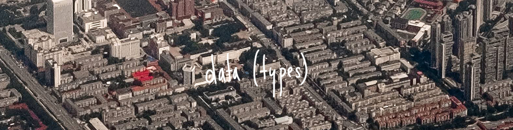
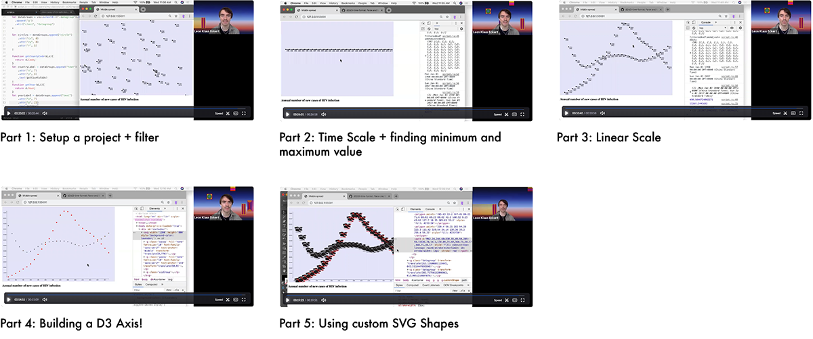
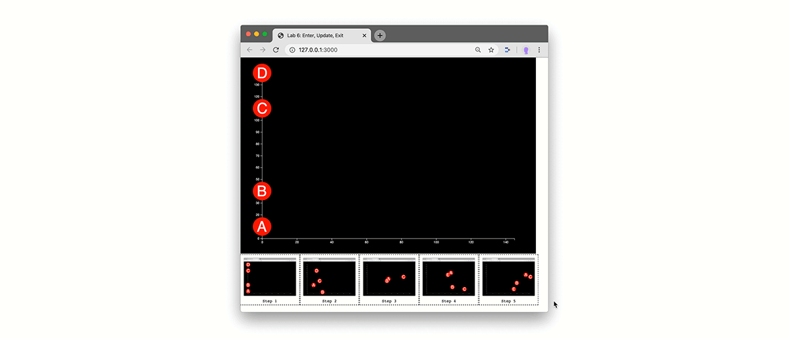

# Critical Data & Visualization 🐣 Spring 2020

Welcome! This page will be filled with material and links throughout the semester. I recommend to **bookmark it now**


- **Instructor**: Leon Eckert, [leon.eckert@nyu.edu](mailto:leoneckert@nyu.edu)
- **Class Times**: Mondays & Wednesdays, 1:15pm-2:30pm ([calendar](https://calendar.google.com/calendar?cid=bnl1LmVkdV9pNzZhYWZzbDRmdTRoZmQzYzVkZjRpZHI2c0Bncm91cC5jYWxlbmRhci5nb29nbGUuY29t))
- **Class Location**: Cyberspace ([zoom links](https://calendar.google.com/calendar?cid=bnl1LmVkdV9pNzZhYWZzbDRmdTRoZmQzYzVkZjRpZHI2c0Bncm91cC5jYWxlbmRhci5nb29nbGUuY29t))
- **Office Hours**: Tuesdays, 11am-1pm, 6-7pm （[sign up](https://calendar.google.com/calendar/selfsched?sstoken=UUE0X1AyMVlCNnpyfGRlZmF1bHR8ZTBmYjk2MTcyMjZkZmUwMzhjYTllN2IxMzlkMmQ4MTU)）
- [Official Syllabus](https://drive.google.com/drive/folders/1hsDaMtkUvd-vg_qBLQJkBr30WV3cBB5b?usp=sharing) (accessible with NYU e-mail address)

#### Quick Links

- [current assignments](other/current-assignments/README.md)
- Problems with Zoom or other things? >> [NYU's Digital Teaching & Learning Toolkits](https://wp.nyu.edu/toolkits/)

#### Course Description

Course Description
Data collection and algorithmic processing are not only central to recent technical breakthroughs such as in Artificial Intelligence and automation but have created new economic paradigms where data equals value and shape political approaches to power and control.

Decisions based on algorithms affect society at large whether it’s changing the way we transport and distribute goods, influencing the things we buy or the news we read. The world that algorithms see is data. For the average person, however, data is seldom more than an abstract idea.

So, what exactly is data? How is value extracted from it? And why should we care? How can we ethically balance the positive uses of data-driven systems with the threats they pose to discriminate and infringe basic human rights? This course seeks to untangle some of these issues practically and theoretically.

### Content
- Week 1 - [Mapping The Landscape](#week-1)
- Week 2 - [Data Types](#week-2)
- Week 3 - [Human / Bias I](#week-3)
- Week 4 - [Human / Bias II](#week-4)
- Week 5 - [Prediction & Uncertainty](#week-5)
- Week 6 - [Data Zine Project Presentation 🎉](#week-6)
- Week 7 - [Surveillance Capitalism I](#week-7)
- Week 8 - Surveillance Capitalism II
- Week 9 - Ethics & Privacy
- Week 10 - Data Story Contextual Report & Presentation 📚
- Week 11 - Power & Control I
- Week 12 - Power & Control II
- Week 13 - Resistance
- Week 14 - Data Story Presentations 🥂

## Week 1


### Monday Class

Introductions.

Group Activity: Mapping the subjects of this course.

Take-aways:
- Data is never “raw”, but always cooked.
- “data”
  - from latin (‘given’)
    - how about "capta" (== ‘taken’)?*
  - used in singular and plural
- data has no truth
- Data and Data Infrastructures
  - looking beyond data as a resource
  - data is performative

<br>
\*J Drucker

#### Assignments:

Due this Wednesday (2020/02/19):
- Do this assignment first (strongly recommended)
-  We will spend 50% of our time in this course coding. Having a shared foundation for this is **extremely important**. I will always be there to support and assist you with problems you encounter. For now, please work your way through [Coding Foundation: Setup and Exercises](coding-foundation) and submit your work in the end.
- Here is a thorough, interactive ``basic-javascript`` tutorial if you want to brush up your skills: [Basic JavaScript](https://learn.freecodecamp.org/javascript-algorithms-and-data-structures/basic-javascript/). And [here](https://www.codecademy.com/learn/introduction-to-javascript) is Codecadey's version.

Due Monday (2020/02/24):
- Read [**Critical Questions for Big Data**](readings/boyd_crawford_2012.pdf) by danah boyd and Kate Crawford. The linked version has some intentional notes that will help you. Please read the whole text despite below prompts being pointed at specific sections. There is no right or wrong, **what counts more than anything is your own opinion**. For each prompt, write no more than a short paragraph:
  - Introduction and Chapter 2
    - Why does Bowker say "'*Raw data is both and oxymoron and a bad idea*'" ? (pp. 663)
  - Section 1 (pp. 665)
    - What could be meant by the quote "'*accounting tools [...] do not simply aid the measurement of economic activity, they shape the reality they measure*'"?
  - Section 3 and 4 (pp. 668)
    - In which way is Twitter data limited?
  - Section 5 (pp. 671)
    - If you don't need to login to obtain certain data, then it is public and free to use. Or isn't it? Please share your opinion.
  - Section 6
    - No prompts here, but a very well written chapter that is relevant to everything we will be talking about this semester. Please enjoy.

- **How to submit the homework**:
  - First, find or create a folder in your repository (e.g. `my-work/week1/reading-response/`). In there, create a `README.md` file.
  - In this file, do your writing (if you want, [format your text nicely](https://guides.github.com/features/mastering-markdown/)).
  - When you are done, [push your changes to your repository](other/how-to-submit-assigments) as you learned in the [Coding Foundation Exercise](coding-foundation) and paste a link to the [class wiki](https://github.com/leoneckert/critical-data-and-visualization-spring-2020/wiki).

###### Optional/Related readings and resources:

- [*\"Breaking the Black Box](https://www.propublica.org/article/breaking-the-black-box-what-facebook-knows-about-you), 4 videos with texts, various ProPublica journalists (2016)\*
- [*\"Raw Data" is an Oxymoron* (Introduction)](https://mitpress.mit.edu/books/raw-data-oxymoron), Gitelman L (2013)\*
- [*\"Raw Data" is an Oxymoron* (Capter 1: Data before the Fact)](https://mitpress.mit.edu/books/raw-data-oxymoron), Rosenberg D\*
- [*Data infrastructure literacy*](https://journals.sagepub.com/doi/10.1177/2053951718786316), Gray J, Gerlitz C, Bounegru L (2018)
- [*Humanities Approaches to Graphical Display*](http://www.digitalhumanities.org/dhq/vol/5/1/000091/000091.html), J Drucker (2011)
- [*Anatomy of an AI System*](https://anatomyof.ai/), Crawford K, Joler V (2018)

\*online version accessible through NYU library

### Wednesday Lab

Find the Lab in detail [here](labs/lab-1)

Content:
- how a browser meets a website
- how a browser sees html
- css and js, endless metaphors
- review homework
- review JavaScript data structures
- collect data using Google Forms
- Mini data visualization using javascript

#### Assignments:

Due Wednesday (2020/02/26):
- Mini Project:
    - Create a Google Form collecting data of the "linear scale" type (like we did in this week's Lab)
    - collect responses from at least 10 people (e.g. send it to people in this class (use Slack or even Discord))
    - use the techniques [used in the lab](labs/lab-1) to
    - export the data in `json` format
    - transform it to an array with average values
    - build a bar graph using JavaScript ([lab's code](labs/lab-1/in-class-website))
        - be creative and make it look **more fun** than my example!
    - the last two points can be worked on simultaneously (**you don't need all the responses to start working on the code**)
    - relvant links:
        - [How to collect data using Google Forms
    ](labs/collect-data-google-form)
- Watch [this fun talk by Mike Bostock](https://vimeo.com/69448223), creator of [D3js](http://d3js.org/).


## Week 2



Data (types or categories)

### Monday Class

[today's slides](https://docs.google.com/presentation/d/1KMWsv-aqrG9gUheQfMJmR0iXoWAc7cQP9Lje_u2EEpU/edit?usp=sharing)

- discussion of "Critical Questions for Big Data"
- data (types) exercise
- art works I'd like to share
- Announcing Data Zine Project


#### Assignments:

Due Monday (2020/03/02):
- Read and add three contributions to this weeks reading assignment of "*You Are Your Data*" by Deborah Lupton. The text and the description of the assignment are in [this document](https://docs.google.com/document/d/1hl5ehstO1GhcWEio7DIl55m22Aqr3FDEl8rDK2bdsTQ/edit?usp=sharing).
- Listen (and enjoy) to this podcast: *Artificial Intelligence: The Problem with Bias, with Kate Crawford*. Here is a [Spotify Link](https://open.spotify.com/episode/0ysGO67iXaPmTx4h9v33z3?si=FmJeEuyJTeiqckjpHCTlVQ) - if you have trouble accessing, please contact me.
- Read through the Data Zine Project brief, especially the “The Data” paragraph, multiple times.
  - Define on a phenomenon that you will document/collect data about.
  - Name the features that you will take note of.  
Be poetic.
  - Check back with me on Slack if you are unsure or need help deciding between different options.
  - Start collecting your data tonight and present a week’s worth of data next week.


### Wednesday Lab

Find the Lab in detail [here](labs/lab-2)

Content:
- What is a library?
- Hi, D3!
  - pixels vs. SVG
  - examples
  - Data Driven Documents
- What you see when you see D3
  - Something dot something dot something semicolon
- **Code**
  - Download working files
  - Part 1: The Start ([Video](https://nyu.zoom.us/rec/share/yO9uELX6rUdIZc_R2XHxAa4oT6nnX6a8h3JL__JenU3HOYj2dbLeTxv9xbKx_bF-?startTime=1582681651000))
    - selections, methods, attributes, return values, shapes
  - Part 2: The Whole Point ([Video](https://nyu.zoom.us/rec/share/yO9uELX6rUdIZc_R2XHxAa4oT6nnX6a8h3JL__JenU3HOYj2dbLeTxv9xbKx_bF-?startTime=1582684221000))
    - binding data to elements, "select nothing?!", enter-selection
  - Part 3: Jaws Drop ([Video](https://nyu.zoom.us/rec/share/yO9uELX6rUdIZc_R2XHxAa4oT6nnX6a8h3JL__JenU3HOYj2dbLeTxv9xbKx_bF-?startTime=1582686145000))
    - data functions
  - Part 4: Real Data ([Video](https://nyu.zoom.us/rec/share/z8ZfA5OgxEhJX52VtFv9Qas4DL_heaa8hnRPq_dZnk7-eH-SSxqAUyOjLnmSBpQQ?startTime=1582689194000))
    - loading data in D3


#### Assignments:

Due Wednesday (2020/03/04):
- Read the [notes from the lab](labs/lab-2) carefully and watch the videos.
- Read them again, and email me questions you have. Book my [office hours](https://calendar.google.com/calendar/selfsched?sstoken=UUE0X1AyMVlCNnpyfGRlZmF1bHR8ZTBmYjk2MTcyMjZkZmUwMzhjYTllN2IxMzlkMmQ4MTU), too.
- Use D3 to turn the dataset you are currently collecting (started after Week 2 class) into shapes.
- Do not worry about visualizing the data *effectively* yet.
- create any shapes from it and use [data functions](labs/lab-2#data-functions) in at least one spot in way that the value of your data point affects the shape you created using D3.
- push your work to your repo and submit a link to the [class wiki](https://github.com/leoneckert/critical-data-and-visualization-spring-2020/wiki) by Wednesday (2019/09/18)


## Week 3


Human / Bias I

### Monday Class


- discussion of reading/listening
  - what is "[*The Problem with Bias*](https://open.spotify.com/episode/0ysGO67iXaPmTx4h9v33z3?si=FmJeEuyJTeiqckjpHCTlVQ)"?
  - in pairs, find arguments for both theses:
    - When making decisions, machines/algorithms/data...
      - ... are more objective than humans.
      - ... are biased.
- Check-in: Data Self collection ([sheet](https://docs.google.com/spreadsheets/d/1SRh-0o51itDFr8xg4VAkXJLHSt-tIllEO-hl8MKeE6A/edit?usp=sharing))
- Current topics: [China's new Internet Content Regulations](http://www.cac.gov.cn/2019-12/20/c_1578375159509309.htm)
- Data Art ([slides](https://docs.google.com/presentation/d/125nhtAiFL-EcsLb0iJwoKTvRPCHXgtbYSGkZ6cyZ9y4/edit?usp=sharing))
- Assignments

#### Assignments:

Due **THIS** Wednesday (2020/03/04):
- Upload a JSON file of the data you have so far self-collected to your repository and post a link to the [class wiki](https://github.com/leoneckert/critical-data-and-visualization-spring-2020/wiki).

Due Monday (2020/03/09):
- "[Automating Inequality](https://us.macmillan.com/books/9781250074317)" (2018) is a fantastic book by Virginia Eubanks that addresses specifically the *who* -- who is impacted by the process of *datafication* of society we discuss in this class. The book discusses the *who* that is not individuals, but groups of people.
  - This week, you don't have to read (you may if you wish; I can make the book available to you), but listen to an interview with the author Virginia Eubanks.
    -  "Writer's Voice, Automating Inequality w Virginia Eubanks" (**1 hour**)
      - [web link](https://www.writersvoice.net/tag/virginia-eubanks/), [Apple Podcast](https://podcasts.apple.com/us/podcast/virginia-eubanks-automating-inequality/id268934105?i=1000454045481), it's on Spotify, too, but I cannot link to it for a strange reason, search for `Virginia Eubanks, AUTOMATING INEQUALITY` and find this image:
      - 
  - Formulate short responses to the following prompts, no more than **400-500 words in total**.
    - How to technical tools promise to "fair out" the remaining discrimination that exist in social/welfare systems? In how far can they succeed, in which ways do they fail?
    - Imagine, what could this (following quotes) mean in the widest sense?
      > "*The state doesn't need a cop to kill a person*" and "*electronic incarceration*"
    - What do you understand this to mean?
      > "*systems act as a kind of 'empathy-overwrite'*"
    - China is much more advanced and expansive when it comes to applying technical solutions to societal processes or instant challenges ([recent example](https://www.nytimes.com/2020/03/01/business/china-coronavirus-surveillance.html?)). Try to point example cases in China that are in accordance or in opposition to the problematics discussed in the podcast. Perhaps you can think of
      > "*technical systems not well thought-through about what their impact on human beings is*"
  - Post your writing to the [class wiki](https://github.com/leoneckert/critical-data-and-visualization-spring-2020/wiki).
- Watch [Machine Learning and Human Bias](https://www.youtube.com/watch?v=59bMh59JQDo) (**3 minutes**)
- Watch [How I'm fighting bias in algorithms](https://www.youtube.com/watch?v=UG_X_7g63rY) by Joy Buolamwini (**9 minutes**)


### Wednesday Lab

Find the Lab in detail [here](labs/lab-3)

Content:
- [useful resources](other/resources)
- Binding Data to Elements: Various Scenarios
  - a **no-code** introduction to enter-, update-, and exit-selections ([slides](https://docs.google.com/presentation/d/1B8bSYedD5rO4Tu18KTdbA0u2jMxSOMJFpT856HZIfBM/edit?usp=sharing))
- incoming data: the enter-selection in detail ([slides](https://docs.google.com/presentation/d/1u0r8bXqpMTD-H6xq3mYBjHmQNkIfn27iMgERj6AZY5E/edit?usp=sharing))
- loading data and data functions: 2 "*rules*" to avoid errors
- Classes: why & how we should use them ([video](https://nyu.zoom.us/rec/share/949WdJOr_WZJZ4Gdr0rFBYkPQZ_Vaaa82nBI-vsLmE7rf2Tn3ZAgfjdQoPpq8TQ2)\*)
- Groups: Structure ([video](https://nyu.zoom.us/rec/share/1_VRPqnr53tJQ7ff7mDlQ7EFQtjFX6a81yge8vJYnkfUcXCcnG6MNZ6SNoAZ7Sv2)\*)

\*videos can be downloaded on the same link

#### Assignments:

Due Wednesday (2020/03/11):
- Visualize your data making use of group (`<g>`) elements
- Your data points have multiple categories (names, values, labels etc.). Make each category affect a different aspect of a visual representation in a group.
- Take this example by [Giorgia Lupi](http://giorgialupi.com/dear-data). Each shape is a group of other shapes with attributes that represent different aspects of the data. She describes her logic on the back of the postcard. Create your own such logic for your data, and group shapes with different attributes into svg group elements.
  


## Week 4


Human / Bias II


### Monday Class


- discussion of ["*Automating Inequality*"](https://github.com/leoneckert/critical-data-and-visualization-spring-2020/wiki/Responses-to-Automating-Inequality-(week4))
- Group Exercise!* ([slides](https://docs.google.com/presentation/d/1xaiOLn12vRbB4oAsggFmZdZEmsXx1sCrLaOQcHfvFGg/edit?usp=sharing))
- the [Data Zine Project](projects/data-zine-project) is due on:
```
      MONDAY, 2020/03/23
```
- Data Zine: Prototype([A3](other/material/datazine-paperprototype.pdf)，[A4](other/material/datazine-paperprototype-a4.pdf)） (see assignments) and [Coding Template](other/material/datazine-template.zip).

\*with thanks to Mimi Onuoha And Mother Cyborg (Diana Nucera); the activity is taken from their publication "[*A people's guide to AI*](https://www.alliedmedia.org/peoples-ai)" (2018)

#### Assignments:

Due **THIS** Wednesday (2020/03/11):
- Read the following Chapters of The Visual Display of Quantitative Information by Edward R. Tufte:
  - Graphical Excellence
  - Graphical Integrity
  - Sources of Graphical Integrity and Sophistication
  - I highly recommend getting a physical copy from the library. A [digital version]https://drive.google.com/file/d/1Hz0ZRcJYTy-WkZQq3_DYJ9MLq5eF3k5C/view is also  available on request.
- Paper prototype for your Data Zine Project:
  - Print out [the template](other/material/datazine-paperprototype.pdf) on A3-sized paper, or [this template](other/material/datazine-paperprototype-a4.pdf) on A4-size paper.
  - Sketch out where you are planning to put which information (graphic and descriptive text). Remember you can create more than one visualization to illustrate different aspects of your data set.
  - Scan your prototype, push it to your repository and add a link to the [class wiki](https://github.com/leoneckert/critical-data-and-visualization-spring-2020/wiki).

Due Monday (2020/03/16):
- To take in:
  - Read [*The Minority Report*](readings/Philip-K-Dick-The-Minority-Report.pdf) by Philip K. Dick.
  - Read [*What statistics can't tell us about ourselves*](https://www.newyorker.com/magazine/2019/09/09/what-statistics-can-and-cant-tell-us-about-ourselves) by Hannah Fry (September 9, 2019 Issue of The New Yorker)
  - Listen to two parts of **Reply All's 'The Crime Machine' Podcast**. This is both super entertaining AND relevant next class. You can listen to the podcast via
    - your browser ([Part 1](https://gimletmedia.com/shows/reply-all/o2hx34), [Part 2](https://gimletmedia.com/shows/reply-all/n8hwl7))
    - spotify ([Part 1](https://open.spotify.com/episode/6uagdYENZ1HjiaeX7gbqIN), [Part 2](https://open.spotify.com/episode/4ULMa8oh9nJWSv4PM9gPNh))
    - apple podcast ([Part 1](https://podcasts.apple.com/hk/podcast/127-the-crime-machine-part-i/id941907967?i=1000446958122), [Part 2](https://podcasts.apple.com/hk/podcast/128-the-crime-machine-part-ii/id941907967?i=1000446958123))
    - other services (search "Reply All Crime Machine")
- To put out:
  - Think of contemporary systems/applications in which data is used to predict the future in order to then act upon it. Compile a list of 3 such situations that come to your mind and describe them **briefly**.
  - Collect your thoughts on the *Prediction* and its role in the three above sources. Your associations, opinions and ideas may be complemented by reflections on *"collective average vs individual fate"*, *"statistic vs. algorithmic prediction"* or *"social physics"* (but don't feel obliged to discuss these). Express yourself in 300-400 words.
  - add your writing to the [class wiki](https://github.com/leoneckert/critical-data-and-visualization-spring-2020/wiki).


### Wednesday Lab

Find the Lab in detail [here](labs/lab-4)

Content:
- intro to scales (with pictures) [slides](https://docs.google.com/presentation/d/1fRveGavkf0OOO7wL35Q4INLJjrYASywdpfBITSsrOCU/edit?usp=sharing)
- live coding demo: high buildings
- live coding demo: dead celebrities

#### Assignments:

Due Monday (2020/03/16):
- Be prepared to explain your Data Zine project to me in 2 minutes. Prepare visuals (your paper prototype, your in-progress coding, and more if necessary) to support your explanation.
  - On Monday we will be chatting in a one-on-one setting to understand where you are in your process and what your needs are going forward.


Due Wednesday (2020/03/18):
- **Aim** to upload a finished version of your Data Zine project.
  - Make notes of difficulties you still need to resolve.


## Week 5


Prediction & Uncertainty

one-on-one check ins, each 4.6666666667 minutes ((75mins class time - 5 mins intro time)/14 students):
- [ ] Iris
- [ ] William
- [ ] Daisy
- [ ] Kris
- [ ] Novia
- [ ] Ellen
- [ ] Kenneth
- [ ] Lydia
- [ ] Thea
- [ ] Sumner
- [ ] Lishan
- [ ] Crystal
- [ ] Yufeng
- [ ] Shiny


### Wednesday Lab

##### Lab 5 - Review + Axis & Custom SVG Shapes

Find the Lab in detail [here](labs/lab-5)

Content:
- check out WIP
- Review and New Learnings
  - Part 1: Setup a project + filter ([video](https://nyu.zoom.us/rec/share/yJRzFaro5mhOY6fOskL2Z_IYMoH1aaa81yEaq_Vfnh5dmn7vEmW6Zgh8v0Nxa-qM) 20:44)
  - Part 2: Time Scale + finding minimum and maximum value ([video](https://nyu.zoom.us/rec/share/3chwBY__3GxIfY3S4h7fAfcxHKWieaa82iJIrPsLzE1B5r_DKLWWmbZJ6mPMPAiW) 26:18)
  - Part 3: Linear Scale ([video](https://nyu.zoom.us/rec/share/ytVWIbj11UZLX6fWzXz6S_N_Q7_Deaa80Ske8vULzhrekISPlrz04SGT_iqEFq37) 10:58)
  - Part 4: Building a D3 Axis! ([video](https://nyu.zoom.us/rec/share/3-xaA63b-39JYNLo6mPTXow4B4rAT6a81SYWq_IEmhr8NioRHaGb6btXH5RxOJHl) 15:09)
  - Part 5: Using custom SVG Shapes ([video](https://nyu.zoom.us/rec/share/5-IlAqPhp31ISY322Wv9UaJ4Mp21T6a80CcZ_PAMzkowcy_hDPqT4SEiLQHcQPMR) 19:51)
- Question




### Saturday Lab

##### Lab 6: Enter, Update, Exit, Transitions

Find the Lab in detail [here](labs/lab-6)

- In the lab, we are building this visualization:
  - 


#### Assignments:

Due Monday (2020/03/23):
- Please **record a video presentation** of you project.
  - The video should be **2.5 minutes long**.
  - The video should be a screen capture in which you flick through the pages of you zine.
  - As you show the pages, discuss the following questions - feel free to add other things you want to say, or change the order, be yourself :)
    - What data did you choose to collect?
    - How did you collect it, what was the routine?
    - Why did you choose to visualize the data in this way?
    - What can be seen in the visualization? Does it reveal something you didn't expect?
    - Did you make crucial compromises? Which ones?
    - If this project had a larger scale and wasn't built for print, how would you imagine it to be?
  - When you are done, drop the video into [this folder](https://drive.google.com/drive/folders/1es18O3IMwhZj00WaHHfh4U4sbsHNbM4C?usp=sharing) and add a link to the [class wiki](https://github.com/leoneckert/critical-data-and-visualization-spring-2020/wiki) (no worries, only nyu emails can see the Google Drive).


## Week 6


### Monday Class

During the Presentations, **please help each other** by giving feedback, thoughts, ideas, inspiration in [this document](https://docs.google.com/document/d/1DqT94lHkJjgclopknO2qbi_IDerTHDnJ0EFvVw941VM/edit?usp=sharing).

Presentation Order:
- [X] Iris
- [X] William
- [X] Kris
- [X] Lydia
- [X] Yufeng
- [X] Shiny
- [X] Daisy
- [X] Sumner
- [X] Kenneth
- [X] Lishan
- [X] Ellen
- [X] Thea
- [X] Crystal
- [X] Novia


#### Assignments:

Due Wednesday (2020/03/25):

- Find two articles that tell a story with data and data visualization.
  - Supply links to them in a markdown file alongside 2-3 sentences explaining what they are about. Push the file and add a link to the class wiki.
  - Be prepared to explain what you enjoy about these articles and the way they use data / data visualization.
  - finding your own sources is highly encouraged. Nevertheless, here are potential sources: [nytimes](https://www.nytimes.com/interactive/2018/us/2018-year-in-graphics.html), [washingtonpost](https://www.washingtonpost.com/graphics/2018/ns/best-graphics/), [fivethirtyeight](https://fivethirtyeight.com/), [pudding.cool](https://pudding.cool).


Due Monday (2020/03/30):
- This weeks coding exercise is described in detail in [Lab 6](labs/lab-6)
  - do you best solving the exercise, then post a link to the [class wiki](https://github.com/leoneckert/critical-data-and-visualization-spring-2020/wiki).


## Week 7


Surveillance Capitalism I


### Wednesday Class

- Presenting and discussing the data articles we found.
- Briefing: [Data Story Contextual Progress Report & Presentation (and Data Story)](/projects/data-story-and-contextual-report-presentation)
  - inspiration: [The Articles That You Found](https://github.com/leoneckert/critical-data-and-visualization-spring-2020/wiki/Two-Data-Articles-(week-6)), our [Resources Page](other/resources).


#### Assignments:

Due Monday (2020/03/30):
- Take a deep dive into the datasets that you can find online.
  - Find three different datasets that you like, write a short paragraph highlighting what they are about and how you could imagine building a project around them.
  - collect those notes in markdown file, push to your repo and submit a link to the [class wiki](https://github.com/leoneckert/critical-data-and-visualization-spring-2020/wiki).
  - Find some sources for datasets in our [Resources Page](other/resources).
    - if you find other cool sources (both english and chinese), consider submitting them to [a collection I have started](https://docs.google.com/forms/d/e/1FAIpQLScfgFIBxAlW9Qz7t2jO6GViJ8y0utwFQBdEQORXuNMBkKTE8Q/viewform?usp=sf_link) 😊
    - Dedicate time to this research, find something that you feel connected to and inspired by --> you will spend about seven weeks dealing with the subject you choose, pick something exciting.
    - What matters is your passion for the subject as well as the potential for creative visualizations of it.
    - keep your mind open to the possibility of collecting or scraping an interesting dataset - if this is something of interest to you, I will assist and advise you.

Due Wednesday (2020/04/01):
- Prepare a very short presentation about your favorite of the three subjects your pre-selected.
  - Each of you will present their topic in this format:
      - 5 slides that can only contain images (no text!)
      - 20 seconds per slide as you talk along explaining your interest and what you hope to make visible through your project
      - practice your text and its timing (email it to me by Tuesday if that helps)
      - this is a VERY short presentation, do not invest more than maximum (!) 2 hours to prepare it.
      - Add your 5 slides to this [Drive Folder](https://drive.google.com/drive/folders/1i_e5ZYJSRhOkGH_SgAkrsmxqPuDDYLr_?usp=sharing) by Tuesday night, please.
- "Surveillance Capitalism"
  - Watch Shoshana Zuboff's talk on [The Rise of Surveillance Capitalism](https://www.youtube.com/watch?v=2s4Y-uZG5zk)
    - 
    - Intro: Zuboff's fascinating book ["*The Age of Surveillance Capitalism: The Fight for a Human Future at the New Frontier of Power*"](https://www.publicaffairsbooks.com/titles/shoshana-zuboff/the-age-of-surveillance-capitalism/9781610395694/) was published in 2019 and sparked many discussions. I would be happy to share the Introduction Chapter with you if you are interested - we also [have it (physically) in our library](https://bobcat.library.nyu.edu/permalink/f/1umpk5p/nyu_aleph006571029). It even made it onto the list of [Barack Obama's Favorite Books of 2019](https://twitter.com/BarackObama/status/1211033245812441091)!
    - Please write **a short 200-300 response** to the talk you watched:
      - In your own words, what does Zuboff mean by "Surveillance Capitalism".
        - These figures from the book may help you: [Figure 1](readings/zuboff-taosc-figure-1.png), [Figure 2](readings/zuboff-taosc-figure-2.png), [Figure 3](readings/zuboff-taosc-figure-3.png)
      - Is there aspects of Zuboff's ideas that...
        - ...you were partilcuarly surprise by?
        - ...disagree with?
        - ...spark associations with your own exoerience?
        - ...you want to ask further questions about?
    - link to it on the [class wiki](https://github.com/leoneckert/critical-data-and-visualization-spring-2020/wiki) when you are done.

###### Optional / Further Reading:
- [Big Tech’s Big Defector](https://www.newyorker.com/magazine/2019/12/02/big-techs-big-defector), New Yorker, Brian Barth (2019)
- [You Are Now Remotely Controlled](https://www.nytimes.com/2020/01/24/opinion/sunday/surveillance-capitalism.html) by Shoshana Zuboff in the New York Times


<!-- ## Week 8


Surveillance Capitalism II -->


<!-- ## Week 9


Ethics & Privacy -->


<!-- ## Week 10


Data Story: Contextual Report Presentations -->


<!-- ## Week 11


Power & Control I -->


<!-- ## Week 12


Power & Control II -->


<!-- ## Week 13


Resistance -->


<!-- ## Week 14


Data Story: Final Project Presentation -->


#### Course Overview and Learning Outcomes

The overarching goal of this course is for students to gain the tools and the comfort to think critically about the ways data is utilized in the ever-growing technological landscape we are immersed in. With this in mind, the course is split in two weekly sessions: a theoretical class and a practical lab.

The classes include lectures introducing contemporary theorists, artists, groups, and in-class discussions or exercises. Themes guiding this exploration include “Human / Bias”, “Prediction & Uncertainty”, “Surveillance Capitalism”, “Ethics & Privacy”, “Power & Control” and “Resistance”. In the weekly lab, students will learn the fundamentals of web-based data visualization using JavaScript. The purpose of this is to understand what data feels like through hands-on experimentation and what data says or doesn’t say by rendering the information it carries visually.

Upon Completion of this Course, students will be able to:
- **map** actors, their roles and relations within a broader data infrastructure.
- **identify** problematics of "datafication" and **generate** ideas for response.
- **identify** various visions, values and cultures inherent to datasets.
- **build** data visualizations for the web.
- **build** their own datasets.
- **make** use of data APIs and scraped data.
- **visually** communicate information pertaining to a given dataset.
- **critique** their own work and others' constructively.
