## Coding Foundation: Setup and Exercises

If things are unclear, please e-mail me at leon.eckert@nyu.edu

Content:
- [Setup](https://github.com/leoneckert/cdv-fall19/tree/master/coding-foundation#setup)
  - [GitHub](https://github.com/leoneckert/cdv-fall19/tree/master/coding-foundation#github)
    - Make a GitHub account
    - Create your own repository / "fork" mine
  - [Software](https://github.com/leoneckert/cdv-fall19/tree/master/coding-foundation#software)
    - Google Chrome
    - Atom Text Editor
    - Atom packages
  - [Working Environment](https://github.com/leoneckert/cdv-fall19/tree/master/coding-foundation#working-environment)
    - Clone remote repository using Atom
    - Open your files in Atom
    - Opening atom-live-server
    - [Pushing changes to your remote GitHub repository](https://github.com/leoneckert/cdv-fall19/tree/master/coding-foundation#pushing-changes-to-your-remote-github-repository)
- [Coding Exercise(s)](https://github.com/leoneckert/cdv-fall19/tree/master/coding-foundation#coding-exercise)
  - [Chrome Developer Tools](https://github.com/leoneckert/cdv-fall19/tree/master/coding-foundation#chrome-developer-tools)
  - [File Structure](https://github.com/leoneckert/cdv-fall19/tree/master/coding-foundation#file-structure)
  - [C - O - D - E (build a website)](https://github.com/leoneckert/cdv-fall19/tree/master/coding-foundation#c---o---d---e)
    - various hints and tricks
  - [After you are done](https://github.com/leoneckert/cdv-fall19/tree/master/coding-foundation#after-you-are-done)
    - [Add a README.md file](https://github.com/leoneckert/cdv-fall19/tree/master/coding-foundation#add-a-readmemd-file)
    - [Push your work to GitHub](https://github.com/leoneckert/cdv-fall19/tree/master/coding-foundation#push-it-all-to-your-github)
    - [Add a link to our Class Wiki](https://github.com/leoneckert/cdv-fall19/tree/master/coding-foundation#add-a-link-to-our-class-wiki)


### Setup

##### Github

This semester you will be maintaining your own Github repository to backup and share your work. Think of a repository as an online backup copy of your local (on your computer) project folder. The idea is this:

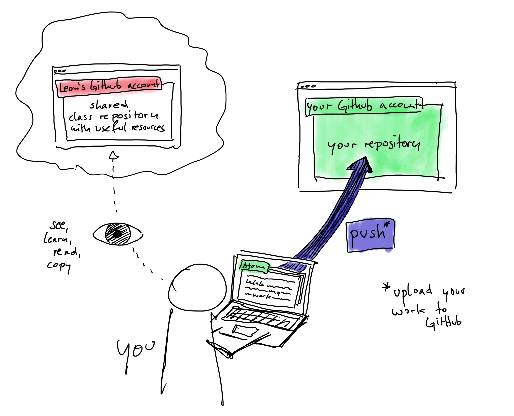

As you can see above, there will be two repositories:
- One is the one I am maintaining (red). That is also the one on which you are reading this text right now. Here you will get information and resources throughout the Semester.
- The other repository is your own one (green). It will live on your own GitHub account and you are the only one that is uploading to it. Instead of "uploading", we will call this action **push**. You make changes to your files (and create new ones etc.) on your computer, then you push them to your "remote repository" on GitHub.


The following steps will guide you through setting all this up. Please follow carefully:

###### 1) Make a GitHub account
This is much like setting up any other account, you will not need much help, except, let me recommend to make a student account instead of a regular one. It comes with some nice, free benefits: [https://education.github.com/students](https://education.github.com/students)

###### 2) Create your own repository
You can create as many repositories as you like. By the way, repositories are public, everyone can see them. It's great to share code, we should all get used to this. However, keep this in mind so you don't accidentally share sensitive information. But don't worry, I will remind you often and show you ways to avoid it :)
You will find a big PLUS symbol on the top right when you are logged into GitHub. This is where you create new repositories. However (!) in our case we will do it differently. That is because I have prepared some files for you to get started. You will "fork" (make a copy) of a repository I have prepared. Follow [this link](https://github.com/leoneckert/my-cdv-ss20)  (ATTENTION: this is a different repository than the one you are reading right now. Note its name) and click on "fork" in the top right corner:

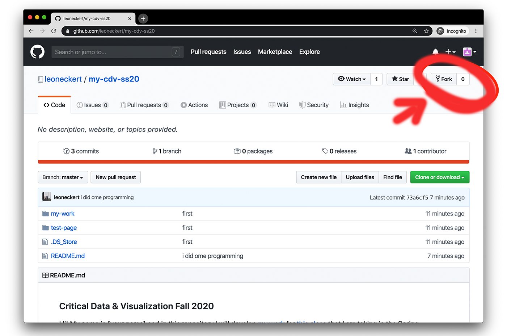

After some seconds you will be redirected to a page that looks almost the same, but, if you look closely, you will notice that you now have your own copy of the repository that I prepared for you. You can also find it under your repositories on your profile:

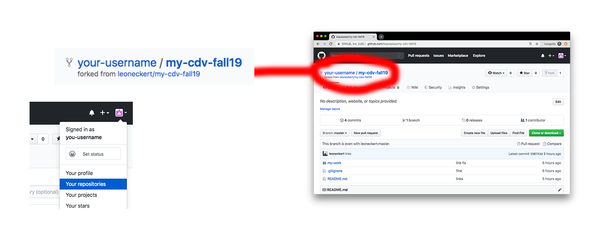

Done with GitHub for now!

##### Software

The order of these steps is not fully worked out :) Now that we have a repository, let's make sure we have the software we will be working with.

###### Google Chrome

This is the browser we will be using. Please [download it](https://www.google.com/chrome/) if you don't have it already.

###### Atom Text Editor

We will be using Atom to write our code. Please download it [here](https://atom.io).

###### Atom Packages

We are going to use four Atom extensions. Three of them come pre-installed. Verify if you see them when you open Atom:

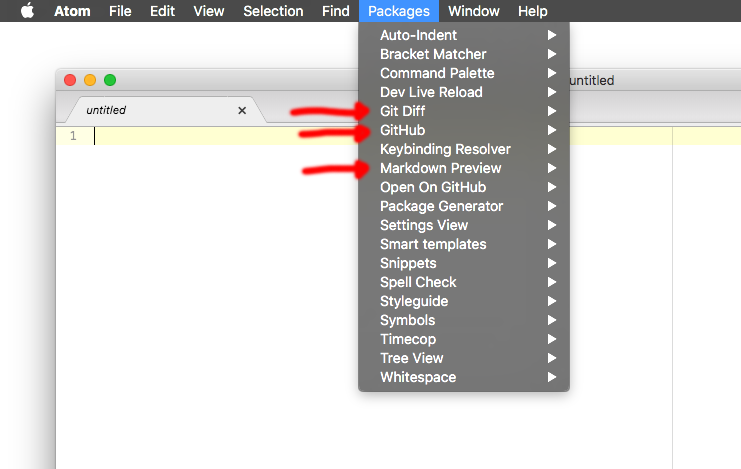

Apart from these, there is one more we need. It's called **atom-live-server** (`atom-live-server-plus` also works). To install it go to ```Atom>Preferences...```, click on ``+ Install``, find **atom-live-server** and hit ``install``:

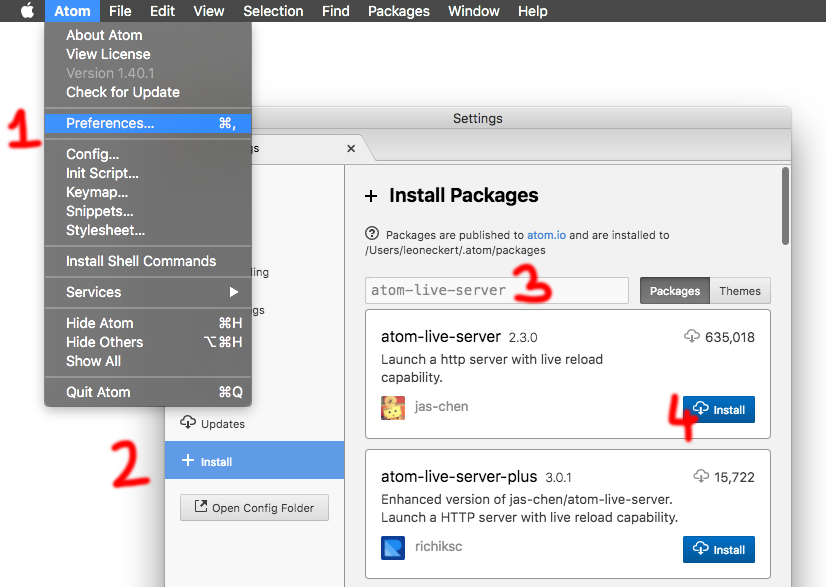

Verify that it is installed (for you, it might appear at a different location in this drop-down menu):


Since we are starting this semester so far apart, see if you can find another package called `teletype`, install that, too, please. We'll test it together soon!

Great! We have achieved a lot. Let's go on!

##### Working environment

For the whole semester, you will always work in the same folder (with subfolder of course). This folder exists already, but only online, in your GitHub repository. Now we will download it, or as we call it in the context of GitHub, we **clone** your repository to you local machine (aka your computer).

###### Clone remote repository using Atom

You only need to do this once in the first week.

First, let's find the repository we want to clone on your GitHub profile - this should be the "my-cdv-ss20" repository that is on YOUR account (the one your forked just a few minutes ago). In order to tell Atom to clone it, the descriptor we need is to be found on the right side, copy the HTTPS-link:

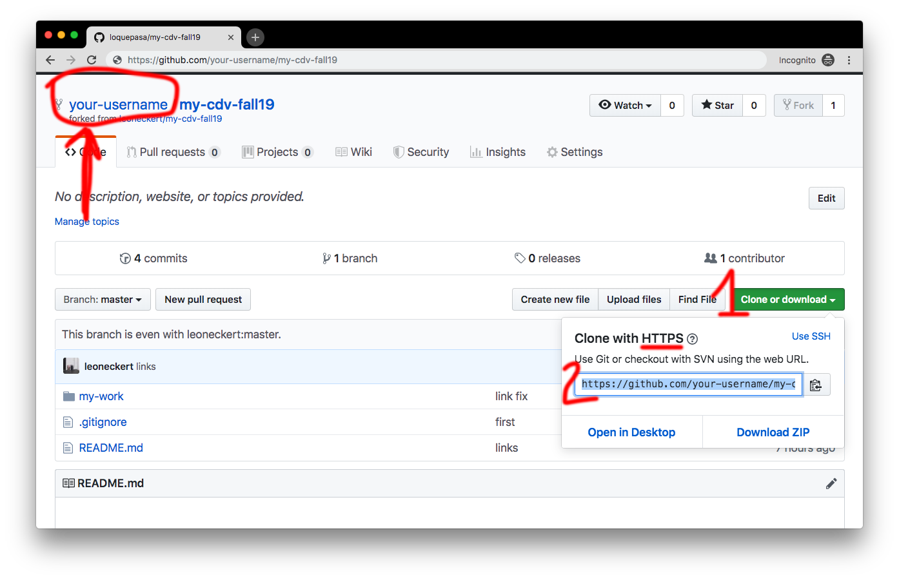


Now open Atom. In the menu bar, click on ``packages > Command Palette > Toggle``. A search bar on the top of your Atom window should appear, search for "GitHub Clone" and hit enter:

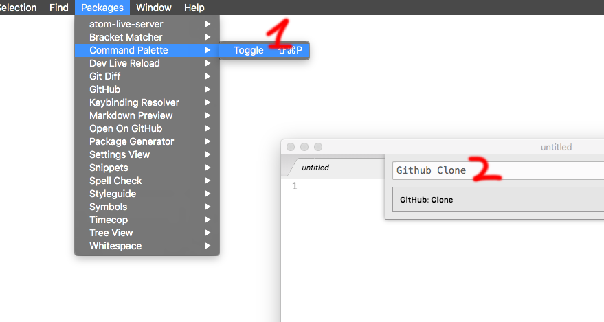

A dialogue window opens on the top of the window. Paste the url you copied from Github to the input line and fill the second like in below screenshot (just with your username of course).

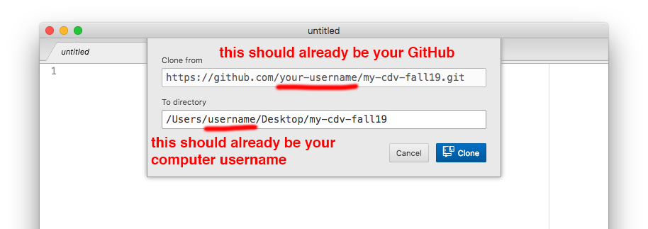

Then click on ``Clone``, wait a little, and have a look on your Desktop:


Quit Atom, and decide where you want to drag this folder to, put it somewhere where it can stay all semester (or maybe you are happy with it on the Desktop - I like my Desktop clean :)

Great, we are very far, everything you will work on takes place in this folder. Follow along as I run you through the basic workflow:


##### Working on your projects

###### Open your files in Atom (the right way(s))
I recommend to use one of two ways to open your class folder in Atom.

- METHOD 1: After opening Atom, click ``File>Open..`` and navigate to your folder, don't click on a subfolder or a specific file, just on the folder named "my-cdv-ss20". Then click ``Open``.
- METHOD 2: Find the "my-cdv-ss20" folder in your file system, drag it onto the Atom application icon.

If you did it correctly you will notice two things. 1) Atom displays all the files and subfolder easily accessible in the sidebar. 2) See this little book symbol next to the name of the repository? That means that Atom knows that it is also a GitHub repository and will make it really easy for us to push our changes to GitHub (because that's the idea if you remember the very first drawing of this tutorial)!

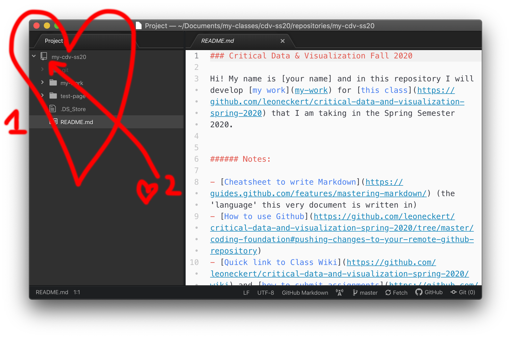

###### Opening atom-live-server

From now on you will always use atom-live-server. Let's see how it works. With your folder open in Atom, click ``Packages>atom-live-server>Start Server``:

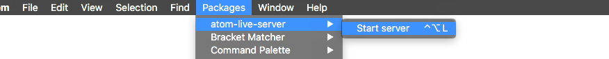

Your browser should automatically open (please define Chrome as your default browser), in the url you will see something like ``http://127.0.0.1:3000/`` or ``http://localhost:3000/`` (the number at the end might vary) and in the browser you see all the folders and files from your "my-cdv-ss20" directory:

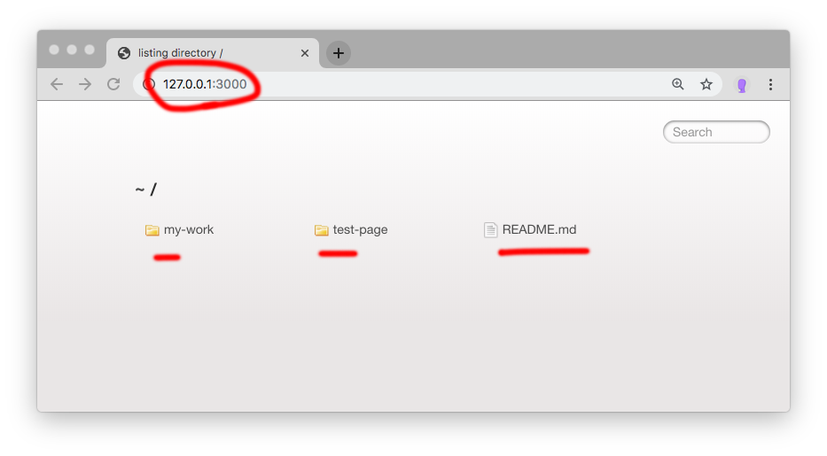

great! this is exciting :D you will be able to see everything you work on here. Mainly you will work on websites in this class, if you work on them while using ``atom-live-server`` you can see changes you makes in real time. In your browser click on the ``test-page`` folder I prepared, a website! If you want, try making a change to the website ``index.html`` file in Atom, save, then return to your browser. Cool right?

###### Shutting atom-live-server down

I assume the best way would be to click on ``Packages>atom-live-server>Stop...``, but if you forget this sometimes and just close Atom, or leave the live server open, that's not a big deal either.

###### Pushing changes to your remote GitHub repository

Okay, I bet this is new for you and I am excited. Let's assume we work on a project somewhere inside the "my-cdv-ss20" directory. Normally this would probably take place in a subfolder like ``my-cdv-ss20/my-work/week3/data-project``, but for now let's make some changes in ``test-page/index.html`` and save them (``cmd+s``). Look at the files in your sidebar, the are orange-ish (or maybe green) now:

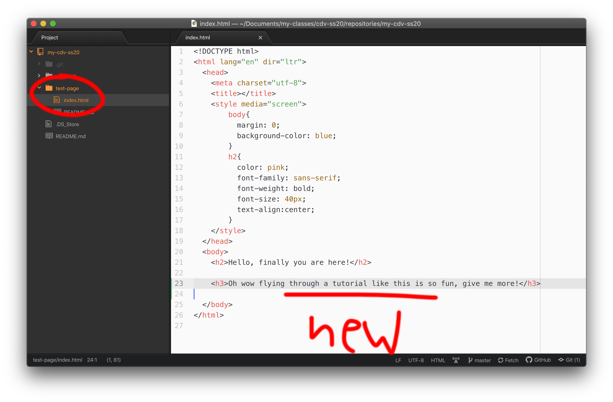

This means that Atom realizes you made changes that have not yet been backed up/pushed to GitHub. Next we want to push these changes. Find the little, tiny "Git" at the bottom right of the window? (If not, look out for "Git" in the menu bar ``packages`` drop down).


After clicking it, a new Tab opens in Atom. It looks a but complicated, I will dedicate a new chapter to this next part:

###### The push

There is **three steps** you need to do every time you **push changes to GitHub**:
1. Stage changes (select which files/changes to commit and push)
2. Commit (add a little messages about the changes you made)
3. Push (push the changes to Github)

**Stage changes** | In most cases you can click "Stage all", which will simply stage all the files in which you made changes since your last push. FYI in the box dialogue you can always see those files.

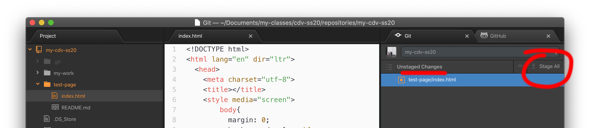

**Commit** | Note how you can now see the files you have staged in the second box. In the box that says "commit message", type a little message describing the changes you made, keep it simple, late at night even a "💤" will do. Best practice is to be specific. One benefit of using GitHub is that you can go backwards in time when your project suddenly doesn't work anymore. You can go back to any commit/push you want. For this, a descriptive commit message is helpful, too. When you are done, click the "Commit to master" button.

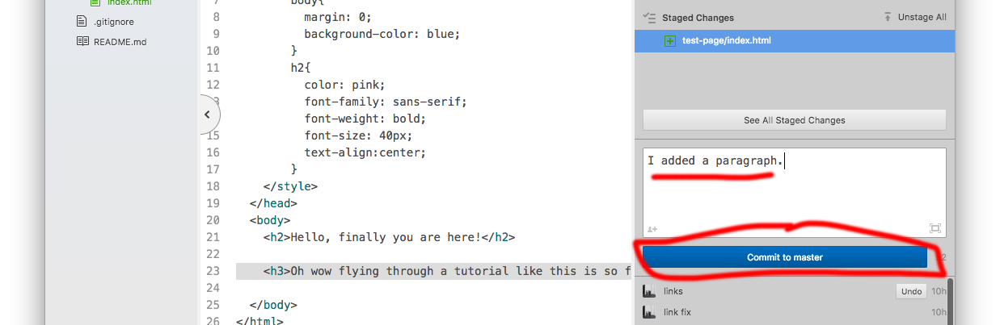

**Push** | The last step is to push it all up to GitHub. Click ``Push`` at the bottom. Then, check your GitHub repository online. Are the changes there? 🤞🤞🤞🤞

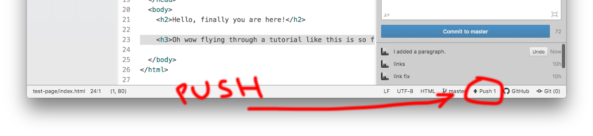


Well, that's it, you made it. You can now use GitHub (and Atom and atom-live-server). This is very cool!!!


### Coding Exercise


##### Chrome Developer Tools

The Chrome Browser gives us tool that are **indispensable** when developing websites. If you understand just two features (the "Elements" tab and the "JavaScript Console") and make use of them while coding, you will build great websites very quick. Please make yourself familiar by reading the [Introduction](https://www.bitdegree.org/learn/chrome-developer-tools) as well as the chapters about [Elements](https://www.bitdegree.org/learn/inspect-element) and the [JavaScript Console](https://www.bitdegree.org/learn/javascript-console).

##### File Structure

It will make your life easier if you organize your files well. Here is the structure I recommend for you ``my-cdv-ss20`` directory:

```
my-cdv-ss20
├── my-work
│   ├── week1
│   │   ├── coding-foundation
│   │   ├── page1
│   │   └── page2
│   ├── week2
│   │   ├── page1
│   │   └── ...
│   ├── README.md
│   └── ...
├── README.md
└── ...
```

Please start to bring such a structure into place. You can create folders and files within Atom's sidebar.

##### C - O - D - E

###### build a website

Finally, making use of the **atom-live-server** and **Chrome Developer Tools** you learnt above, **build a website** in ``my-cdv-ss20/my-work/week1/coding-foundation``. This *chapter* has much fewer instructions than the last ones because I want you to figure out (recall from last Semester / the internet) much on your own. Your website should have **separated html, css, js files** and behave like this one (but does not need to look exactly the same, be creative!):

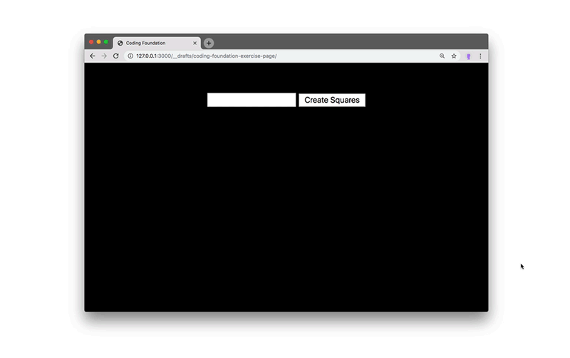

Please build a website like this in pure ("vanilla") JavaScript. Feel free to add you own styling or variations. But keep the functionality: a numerical input with submit button that creates boxes (div elements) and puts them on the page. Give your best and ask the Internet all of your questions, it can help!

###### keyword hints

``getElementById``, ``createElement``, ``appendChild``, ``flexbox``, ``for-loop``, ``addEventListener``, ``function``


###### "it doesn't work!" trick

if things don't behave the way you want/expect them to, please check if there are error messages in the Chrome JavaScript Console (learnt above) - the console should be open by default while you are working. The error message in itself might give you a hint, and if it doesn't, copy-paste the whole error message into Google - someone else likely encountered similar difficulties and found solutions.

###### great Atom trick

if you use Atom to create new files and give them the right extension (".html")...

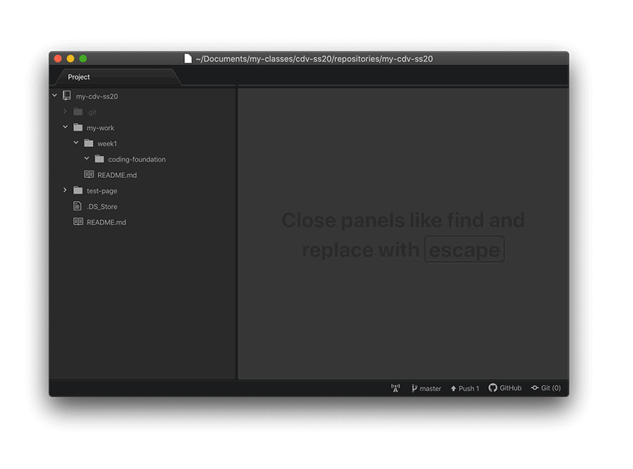

...then Atom will give you very useful auto-complete benefits saving you a ton of work:

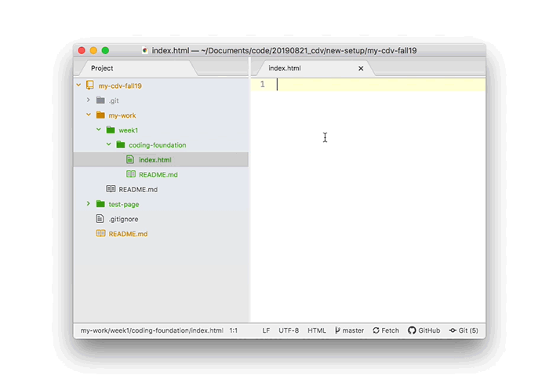


###### comment your code, please
In all coding you do this semester, please make sure to use comments in your code explaining what you are doing. Using atom, you can normally highlight whatever you want to "comment out" and hit ``cmd+/``.


##### After you are done

###### Add a README.md file

Your work will look great on GitHub if you add README.md files to folders. GitHub renders them as the "front page" of a folder - just like you are reading this text right now (it is written on a README.md file, too). The ".md" stands for "Markdown" which is a specific syntax for writing text. Since this might be your first time doing this, simply add the README.md file here:

```
my-cdv-ss20
├── my-work
│   ├── week1
│   │   ├── ...
│   │   └── coding-foundation
│   │       ├── ... <----- the website you just built
│   │       └── README.md  <-------- Add this file
│   └── ...
└── ...
```

and write something into it. If you had difficulties with the assignment, please describe them there. If you want the README.md file look great on GitHub, please see this [Markdown Cheatsheet](https://guides.github.com/features/mastering-markdown/)) as well as the Markdown preview option in Atom (``Packages>Markdown Preview>Toggle Preview``).


###### Push it all to your GitHub

[As learnt above](https://github.com/leoneckert/cdv-fall19/tree/master/coding-foundation#pushing-changes-to-your-remote-github-repository)

###### Add a link to our class Wiki

find the files your have just worked on on your GitHub account (do you see the README.md file rendered, too?). Copy the link to them (this will probably look a bit like ``github.com/your-username/my-cdv-ss20/tree/master/my-work/week1/coding-foundation``) and paste it on our [Class Wiki](https://github.com/leoneckert/cdv-ss20/wiki).

## DONE! 😃
### This was A LOT. Please be proud.
