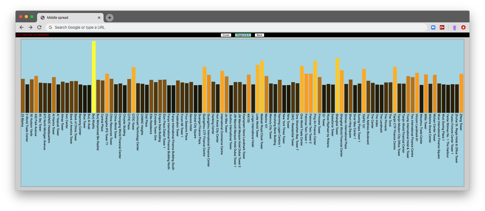
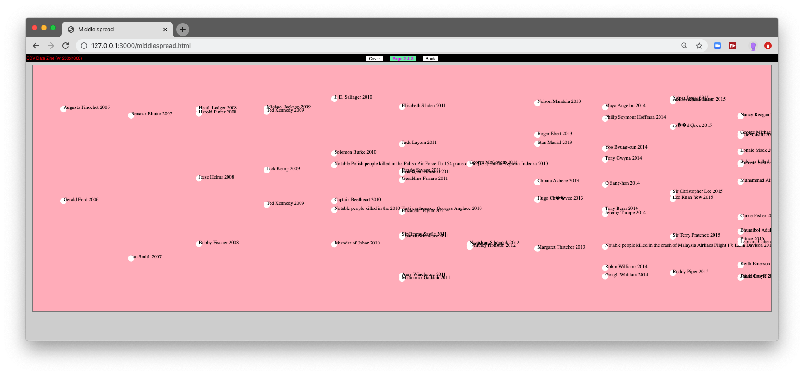

## Lab 4 - D3 Scales

#### today's agenda
- intro to scales (with pictures) [slides](https://docs.google.com/presentation/d/1fRveGavkf0OOO7wL35Q4INLJjrYASywdpfBITSsrOCU/edit?usp=sharing)
- live coding demo: high buildings
- live coding demo: dead celebrities

### live coding demo: high buildings
- [Exercise Files](lab4-linear-scale)
- [Video 1](https://nyu.zoom.us/rec/share/7sZ3Pa2hy2NJQ42KsGrdC5F_Ptn7eaa80CgW_vENzE1KR4dIBYEzRhZQhKIKmZzh)
- [Video 2](https://nyu.zoom.us/rec/share/uJB0ILPQ0EZJe9bO2XHPR_YHQ7bUX6a8hCUa_vsIxUw6p5lCXvsx9Kv4yXOvj_Ad)

(two videos, because my computer ran out of battery)

### live coding demo: dead celebrities
- [Exercise Files](lab4-time-scale)
- [Video](https://nyu.zoom.us/rec/share/yZV8D-GppzxJZtLV2BrVYYV5NIPuX6a81ihK-fQMmE_NQrWdwiOiPOP-SpIIOIQj)

[a commented code](lab4-time-scale-commmented/js/middlescript.js)
