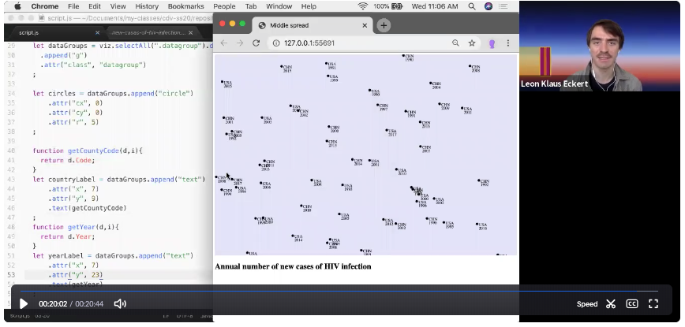
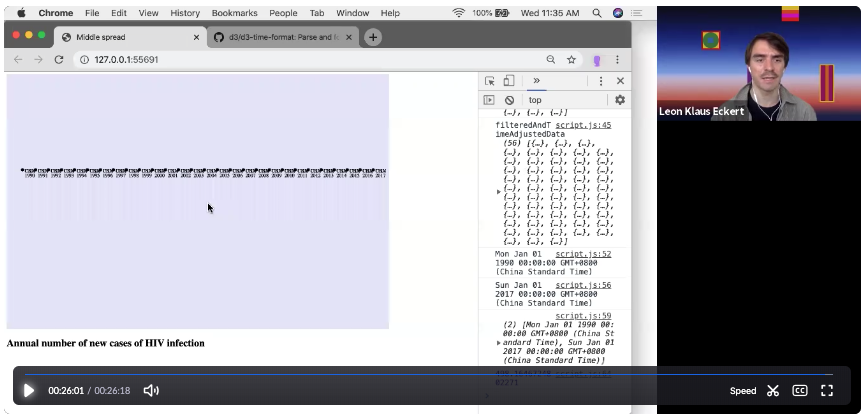
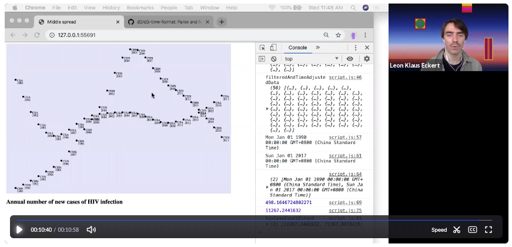
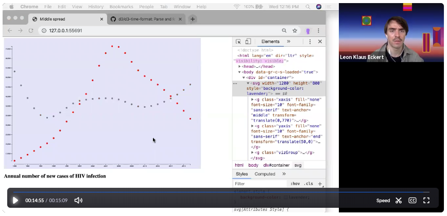

## Lab 5 - Review + Axis & Custom SVG Shapes

#### today's agenda
- check out WIP
- Review and New Learnings
- Question

### Review and New Learnings
- [Download Exercise Files](https://github.com/leoneckert/critical-data-and-visualization-spring-2020/raw/master/labs/lab-5/hiv-graph-start.zip)

##### Videos

- Part 1: Setup a project + filter ([video](https://nyu.zoom.us/rec/share/yJRzFaro5mhOY6fOskL2Z_IYMoH1aaa81yEaq_Vfnh5dmn7vEmW6Zgh8v0Nxa-qM) 20:44)
  
- Part 2: Time Scale + finding minimum and maximum value ([video](https://nyu.zoom.us/rec/share/3chwBY__3GxIfY3S4h7fAfcxHKWieaa82iJIrPsLzE1B5r_DKLWWmbZJ6mPMPAiW) 26:18)
  
- Part 3: Linear Scale ([video](https://nyu.zoom.us/rec/share/ytVWIbj11UZLX6fWzXz6S_N_Q7_Deaa80Ske8vULzhrekISPlrz04SGT_iqEFq37) 10:58)
  
- Part 4: Building a D3 Axis! ([video](https://nyu.zoom.us/rec/share/3-xaA63b-39JYNLo6mPTXow4B4rAT6a81SYWq_IEmhr8NioRHaGb6btXH5RxOJHl) 15:09)
  
- Part 5: Using custom SVG Shapes ([video](https://nyu.zoom.us/rec/share/5-IlAqPhp31ISY322Wv9UaJ4Mp21T6a80CcZ_PAMzkowcy_hDPqT4SEiLQHcQPMR) 19:51)
