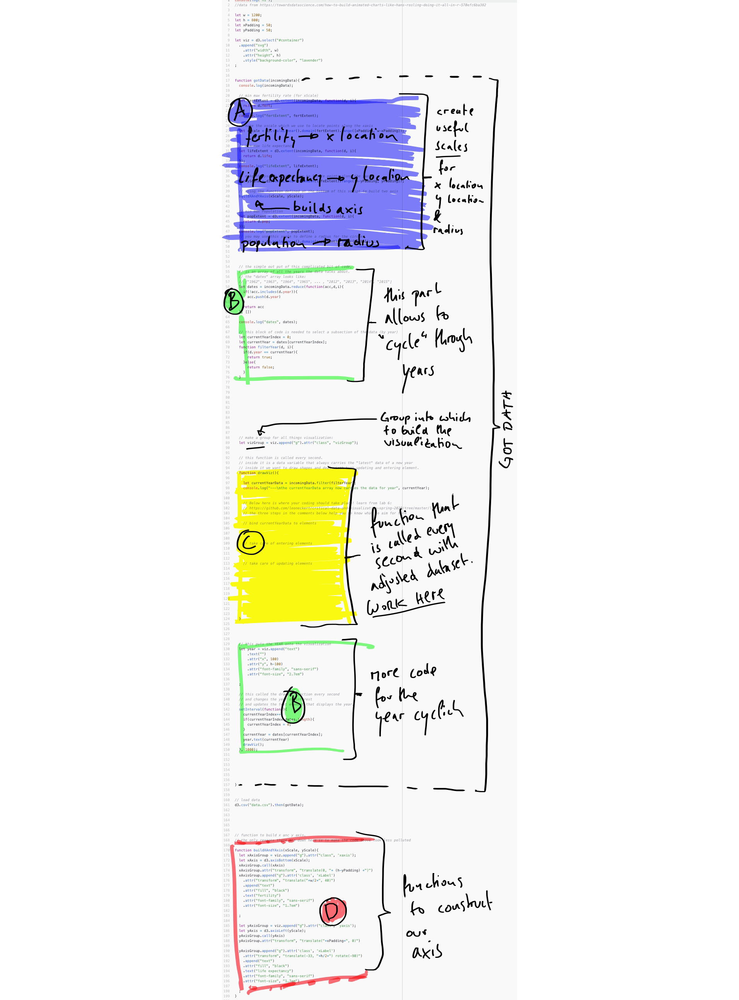
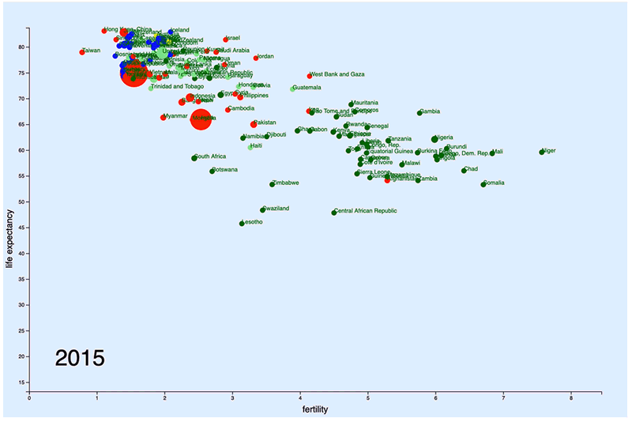

## Lab 6 - Enter, Update, Exit, Transitions

NOTE: videos and material in this lab is ACCIDENTALLY labelled "Lab 7". Please apologize.

#### today's agenda
- In the lab, we are building this visualization:
  - 
- Please download the[ Exercise Files](enter-update-exit-transition-start.zip), then follow these tutorials:
  - Part 1- Data & Setup ([video](https://nyu.zoom.us/rec/share/wdxZHo-u20ROQav17xjyUag5T9TsT6a8hyEX_aIPnRmrgoZ_-6BuiQkaz4cu8u5X) 28:17)
  - Part 2 - Enter, Update, Exit ([video](https://nyu.zoom.us/rec/share/-ZBYHY_A-2JJE5WR4nDHWpQxNJ7Zaaa82yRK_PoEmhrNUd39fNoWcd5w98w4fgUF) 23:17)
  - Part 3 - Transitions ([video](https://nyu.zoom.us/rec/share/5-9Ic6Hg_HpOT7Pi6kOABoEcOIjsaaa81nAe-6UMyk-UMLh3d8jat3QyBtwZeNRz) 9:35)
  - Part 4 - Data Keys ([video](https://nyu.zoom.us/rec/share/3-ZpM--gxnNOGLPR72TTS6cfMYbgT6a82nVIq6EEzkyfDbj4no2Hhdw1p1U5I0pc) 7:41)

#### coding exercise:

- watch the first 5 minutes of [this video](https://www.ted.com/talks/hans_rosling_the_best_stats_you_ve_ever_seen?language=en).
- this weeks assignment is to rebuild the visualization from the video.
- download the [Exercise Code](rosling-start.zip) first.
- study the below overview of what you will find in the code.
- Apply the learning from above video tutorials to visualize the data dynamically.
  - You will mostly be working in section "C" of the code (as labelled in screenshot below).
  - section A is also good to study because you should use the scales for datapoints x postition, y position and radius (if you do circles).
  - the `drawViz` function (section C) is being called every second. Inside it, you can use the array `currentYearData` - at every function call it carries a new set of data (of that current year).
  - you will need to:
    - bring the datapoints onto the page.
    - define what should happen with **entering** elements
    - define what should happen with **exiting** elements
- highlevel overview of the code:
  - 
- this is would your result may look like - but do feel free to style things differently and be creative in your design:
  - 
