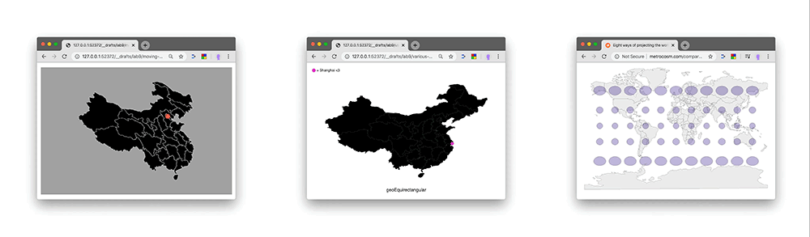

## From Line to Map


- [intro video](https://www.youtube.com/watch?v=kIID5FDi2JQ)
- a line and a map
  - [line](http://cdv.leoneckert.com/geo/line)
  - [map](http://cdv.leoneckert.com/geo/map)
- related inspiration
  - [projections](https://www.jasondavies.com/)
  - [geo to circle (NOTE: old version of D3!!!!)](https://bl.ocks.org/mbostock/3081153)
  - [geo to circle: use case](https://twitter.com/karim_douieb/status/1181695687005745153)
- Line & map
  - both consists of path(s)
  - both draw their path(s) based on data
    - the line most likely draws out the actual data we want to visualize
    - the map is based on geojson data that describes the outlines of countries/provinces/cities we care about
      - this is new to our logic because it means we almost always work with 2 datasets! One for the map, and another for the actual data we want to present on that map
      - [GeoJSON](https://geojson.org/) is a **json file with a highly standardized format**. We don't have to (and shouldn't) attempt to write it ourselves, but find files for almost every geography we ever want to visualize online. Geometric Objects (e.g. the outline of a country) are referred to as "feature" in geojson. Groups of such objects (e.g. a group of outlines for each province of china) are called "FeatureCollection".
        - I usually start with a Google query if I need a specific geojson, e.g. "Germany privinces geojson file".
        - There is also various resources gathered on websites
          - [this might help](https://github.com/tmcw/awesome-geojson#data)
          - [or this](https://geojson-maps.ash.ms/)
          - [teczno.com/squares](http://teczno.com/squares/) (not for geojson, but to get a specific coordinate on the globe).
          - [http://geojsonlint.com/](http://geojsonlint.com/) lets you test geojson files.
          - ...please search the internet yourself, you will be successful
  - how does data turn into pixel values on our page:
    - with lines, we used D3 `.x()` and `.y()` methods to define how our data should be translated onto the page
    - with maps, this is done through "projections"
      - projects are a HUGE subject
        - because it's [physically impossible to turn a 3D world into a 2D image](https://www.youtube.com/watch?v=kIID5FDi2JQ) without making compromises
        - projections are highly political
        - here is a [cool overview](https://storymaps.arcgis.com/stories/ea0519db9c184d7e84387924c84b703f) and some history
        - there are many different projections we can use, find them on [D3s GEO documentation](https://github.com/d3/d3-geo)
        - here is an [overview of D3's projections](https://bl.ocks.org/mbostock/3711652) (old version of D3 again)

#### Some notes:
Working with two datasetsets:
- this means that you will most likely* have a nested structure of data loading:
```js
d3.json("counries.geojson").then(function(geoData){
    d3.csv("otherdata.csv").then(function(incomingData){
      ...visualization code is likely here
    })
})
```
\* I say "likely" a lot because every project is different. There is no perfect blueprint.

Your map is in place, how to address points on the map?
- D3's projects are used to bring the whole map to the page...
```js
let projection = d3.geoEqualEarth();
let pathMaker = d3.geoPath(projection);
```
- ...but can also be used much like familiar scales:
  - we can give a projection a set of longitude and latitude and it will return an array of pixel values that correspond to the location on svg map:
  ```js
  let longitude = 114.163;
  let latitude = 22.299;
  ```
  then the position of a rectangle could be defined like this:
  ```js
  projection[longitude, latitude];
  .attr("cx", function(d, i){
      return projection([longitude, latitude])[0]
  })
  .attr("cy", function(d, i){
      return projection([longitude, latitude])[1]
  })
  ```
  - NOTE: This rectangle will NOT vary in size (radius) along with the projection.
    - for making circles actual part of the map, see [d3.geoCircle()](https://github.com/d3/d3-geo#spherical-shapes)

#### In class exercise:
Download the [Exercise Code](material/line-to-map-start.zip).

[The Video](https://nyu.zoom.us/rec/share/6swvJqj36GpLRZ3Ws2OAdKkGLrXheaa80HJP_PcEzhoqnX-45oi3JUu9gNUDgLEa)


#### assignment:

Below are examples of what you could build over the next (almost) 2 weeks.


